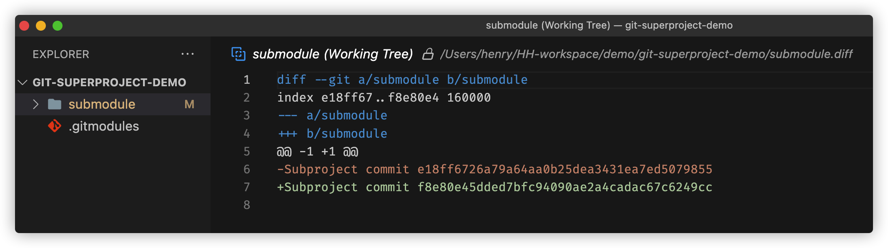
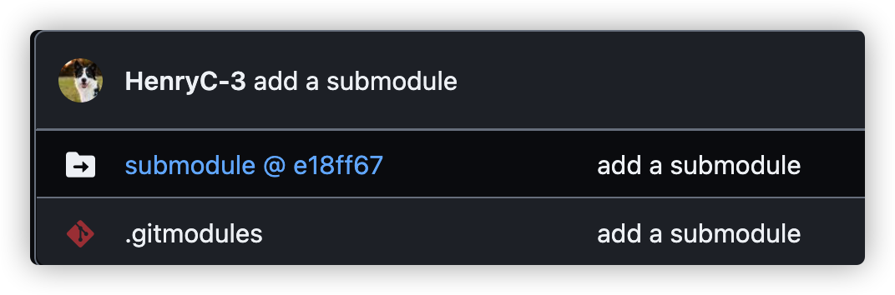
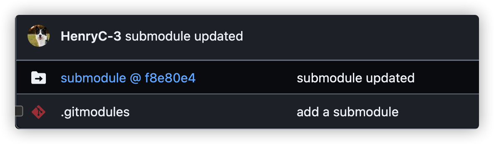

## Add a submodule

```bash
git submodule add <remote-url> <path/name>
```

## What happens to the submodule container after submodule update?

-   `git diff` result
    

-   the link point to the submodule updated.
    -   before module commit [@e18ff67](https://github.com/HenryC-3/git-superproject/tree/62846a70a21fe0d4a7d007e5764f90fce58f0e08) 
    -   after module commit and run `git push origin master` [@f8e80e4](https://github.com/HenryC-3/git-superproject/tree/ae14553d4f6b838c88dd912da25c03fb11c30c1d) 
